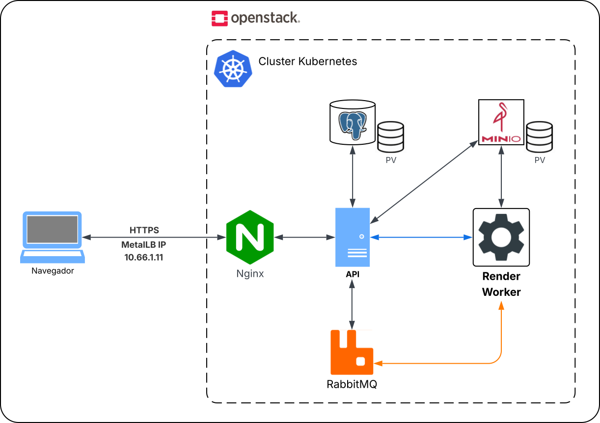
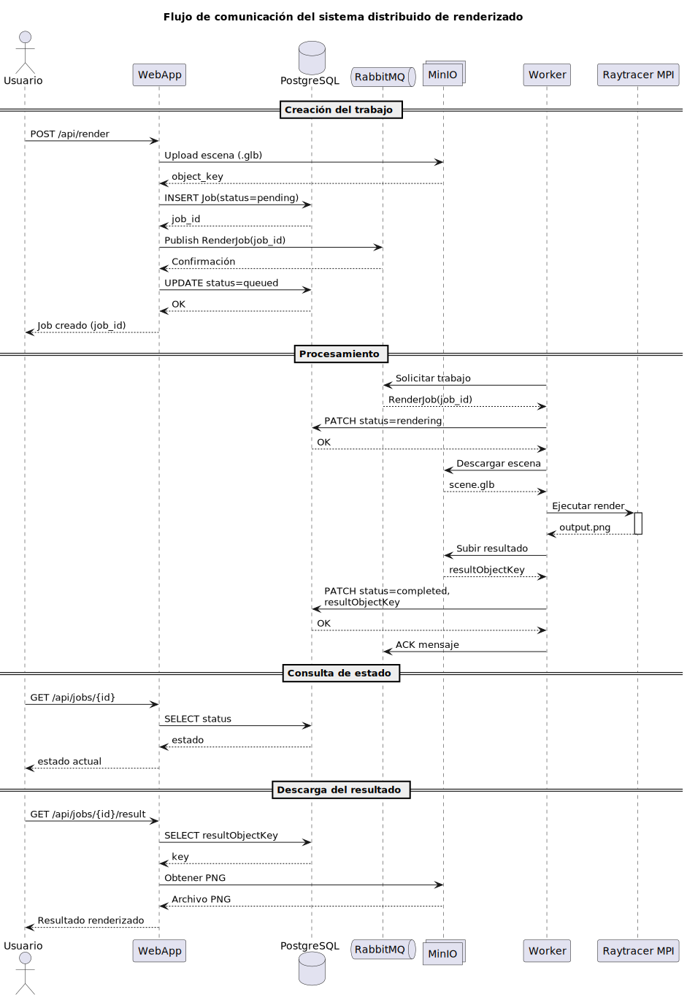

# Sistemas Distribuidos

# Trabajo Práctico Integrador

## Proyecto: Raytracer Distribuido

### Integrantes

* Lucía Alvarez
* Adriano Fabris
* Paula Martinez
* Gonzalo Padilla

## Descripción

El proyecto implementa un sistema distribuido de renderizado mediante raytracing. A través de una aplicación web, los usuarios pueden subir escenas 3D en formato `.glb` y solicitar su procesamiento indicando parámetros como resolución y cantidad de muestras.

Las tareas de renderizado son desacopladas mediante RabbitMQ y procesadas por uno o más workers. Cada worker ejecuta un renderizador desarrollado en C++, genera la imagen final y la almacena en MinIO. El estado de cada trabajo se registra en PostgreSQL y puede ser consultado desde la interfaz web.

## Tecnologías utilizadas

* Kubernetes
* RabbitMQ
* PostgreSQL
* MinIO
* Python (WebApp y Worker)
* C++ (Motor de Raytracing)
* KEDA (Escalado automático de workers)

---

# Arquitectura

La arquitectura general del sistema se muestra en la siguiente figura:



Los principales componentes son:

* **WebApp**: recibe solicitudes de renderizado y permite consultar resultados.
* **PostgreSQL**: almacena la información y estado de los trabajos.
* **RabbitMQ**: desacopla la recepción de solicitudes de su procesamiento.
* **Workers**: consumen trabajos desde RabbitMQ y ejecutan el renderizador.
* **MinIO**: almacena tanto los archivos `.glb` originales como las imágenes renderizadas.
* **KEDA**: ajusta automáticamente la cantidad de workers según la longitud de la cola.

---

# Flujo de mensajes

La comunicación entre los componentes se resume en el siguiente diagrama:



### Flujo detallado

1. El usuario accede a la WebApp y carga un archivo `.glb`.
2. La WebApp almacena el archivo en MinIO.
3. La WebApp registra un nuevo trabajo en PostgreSQL con estado `queued`.
4. La WebApp publica un mensaje en RabbitMQ con la información necesaria para realizar el render.
5. Un worker consume el mensaje desde la cola.
6. El worker descarga la escena desde MinIO.
7. El worker actualiza el estado del trabajo a `rendering`.
8. El renderizador en C++ genera la imagen PNG.
9. El resultado es almacenado nuevamente en MinIO.
10. El worker actualiza el estado del trabajo a `completed`.
11. El usuario consulta el estado del trabajo desde la WebApp.
12. Una vez completado, la imagen renderizada queda disponible para descarga.

---

# Instalación

## Clonar el repositorio

Clonar el repositorio junto con todos sus submódulos:

```bash
git clone --recurse-submodules git@github.com:FING-Sistemas-Distribuidos-2026/PI-Martinez-Padilla-Alvarez-Fabris.git
```

Si el repositorio ya fue clonado sin submódulos:

```bash
git pull
git submodule update --init --recursive
```

---

# Configuración

## Crear el namespace

```bash
kubectl apply -f k8s/namespace.yaml
```

## Generar el Secret

Crear un archivo `.env` con las variables necesarias y generar el Secret:

```bash
kubectl create secret generic raytracer-secret \
  --from-env-file=.env \
  --namespace=raytracer \
  --dry-run=client \
  -o yaml > k8s/secret.yaml
```

---

# Despliegue

Aplicar todos los recursos de Kubernetes mediante Kustomize:

```bash
kubectl apply -k k8s/
```

Verificar el estado de los pods:

```bash
kubectl get pods -n raytracer
```

Verificar servicios:

```bash
kubectl get svc -n raytracer
```

Verificar escalado automático:

```bash
kubectl get scaledobjects -n raytracer
```

---

# Pruebas

## Verificar RabbitMQ

Acceder a la consola de administración:

```text
http://<RABBITMQ_HOST>:15672
```

Comprobar que exista la cola configurada para renderizado y que los mensajes sean consumidos por los workers.

## Verificar MinIO

Acceder a:

```text
http://<MINIO_HOST>:9001
```

Comprobar que:

* Los archivos `.glb` se almacenen correctamente.
* Las imágenes renderizadas aparezcan en el bucket correspondiente.

## Verificar PostgreSQL

Comprobar que los trabajos se registren correctamente:

```sql
SELECT id, status
FROM render_jobs;
```

## Prueba funcional completa

1. Acceder a la interfaz web.
2. Subir una escena `.glb`.
3. Configurar resolución y cantidad de muestras.
4. Crear el trabajo de renderizado.
5. Verificar que el trabajo aparezca en estado `queued`.
6. Verificar la transición a `rendering`.
7. Verificar la transición a `completed`.
8. Descargar la imagen generada.
9. Confirmar la existencia del resultado en MinIO.

---

# Escalabilidad

El sistema utiliza KEDA para escalar horizontalmente los workers según la cantidad de mensajes pendientes en RabbitMQ.

Cuando la cola crece, KEDA incrementa la cantidad de réplicas disponibles. Cuando la carga disminuye, las réplicas son reducidas automáticamente, optimizando el uso de recursos del clúster.
